## Video:

<!-- blank line -->
<iframe align = "middle" width="672" height="378" src="https://www.youtube.com/embed/i7fdP1txuT0" frameborder="0" allow="accelerometer; autoplay; encrypted-media; gyroscope; picture-in-picture" allowfullscreen></iframe>
<!-- blank line -->
  
## Project Summary
Our project is around a Minecraft fireball battle game that we developed. We configured the game ourselves following our own imaginations and using lots of ideas from other classic games like PONG and the mage battle from a map in Warcraft III.(Shown in Fig.1 and Fig.2) The reason why we choose to set up this environment is that we thought this is more like a real video game that we used to play daily and competitively, so this makes more sense to implement artificial intelligence on. 

 
<figure style="text-align:center; margin-left: auto; margin-right: auto;">
  
  <figcaption style="text-align:center; color:blue">
  	Fig.1 Warcrat III maps that inspired our fireball game
  </figcaption>
</figure>

<figure style="text-align:center; margin-left: auto; margin-right: auto;">
  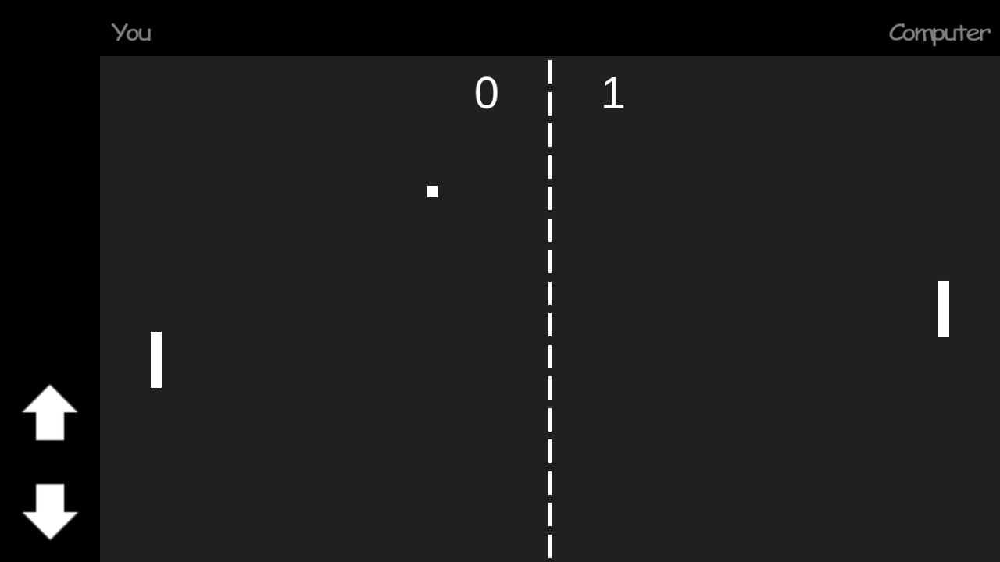
  <figcaption style="text-align:center; color:blue">
  	Fig.2 The first two-player competitive video game
  </figcaption>
</figure>

To step up and make the environment more like a real video game, we restrict the actions our agent can take to some very general and non-trivial ones. The set of actions our agent can take consists of turning the head left and right (mouse movement), move forward and backward (W, S key), move left and right horizontally (A, S key) and throw the fireballs (mouse right-click). Given that all of our actions are continuous, I think they together make a perfect representation of how an actual human player would use mouse and keyboard to control the character, which sets our goal of the project to create an agent and learn how to play a game humanly, and would cause lots of challenges along the way. (Animated in Fig.3)

<figure style="text-align:center; margin-left: auto; margin-right: auto;">
  
  <figcaption style="text-align:center; color:blue">
  	Fig.3 The set of movements allowed for our agent
  </figcaption>
</figure>

However, humans perceive the information from the game using their eyes, we decided to simplify our problem a little bit by inputting the numeric information directly to our agent instead of using another step of processing information from the images of the frames during the gameplay. This not only considerablely reduces our training time, since we wouldn't need to train a convolutional neural network to acquire data visually, but also making the implementation viable by avoiding working with the extremely distorting visual noise while throwing the fireballs. (Fig.4)

<figure style="text-align:center; margin-left: auto; margin-right: auto;">
  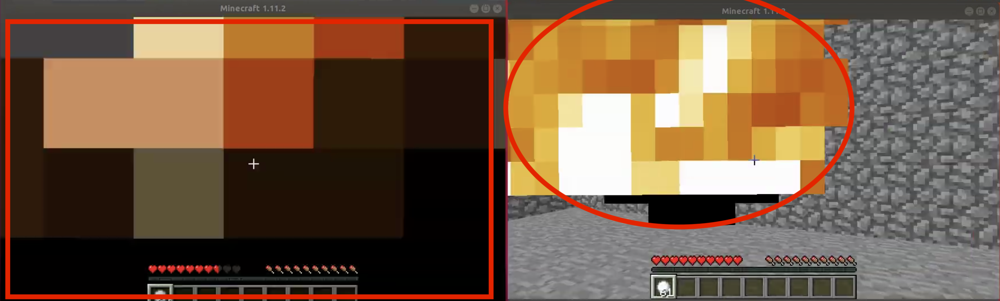
  <figcaption style="text-align:center; color:blue">
  	Fig.4 When being thrown, the fireball completely covers up the screen
  </figcaption>
</figure>

The Final Training arena is a 10 x 10 square field with four walls with height 1 as its boarders.(Fig.5) After setting up the environment initially, there were lots of small changes that we had to make to the map, which turned out to be crutial along the way. For example, many changes were made in order to work with the fireballs. At first, the height of our walls are 4 blocks(both players are not able to see outside the arena). However if the agent releases the fireball too close to one of the walls, the speed of the fireball projectiles would be set to 0, resulting the fireballs not moving and be treated as the ones that Mincraft monsters released, which will damage the agent that throws those fireballs. To deal with that, we made the walls have only heights of 1, and the fireball would fly off the arena even if it's released close to a wall. 

We also reduced the size of the arena from its original size 20 x 20. After spending a few days training in a 20 x 20 map, we barely reached the 1000 episode mark. We realized that the high epsilon at the early stage, paring with a very large map would take us ages to train, since the agent rarely hit its target causing a long episode time. All above is the process of us coming up with the idea and setting up and finalizing the Minecraft environment that we used to train our agent.

<figure style="text-align:center; margin-left: auto; margin-right: auto;">
  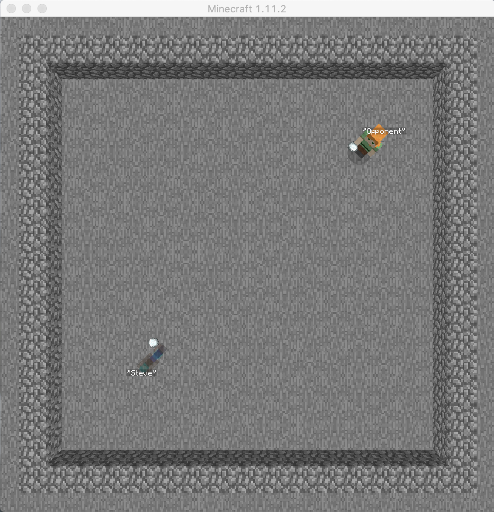
  <figcaption style="text-align:center; color:blue">
  	Fig.5 Our finallized arena
  </figcaption>
</figure>

## Approaches
Because we decided to have a continuous state space and action space, it would be implausible for us to use Tabular Q-Learning Reinforcement Learning to train our agent. The iterative process of computing and updating Q-values for each state-action pair in a large/continuous state space becomes computationally inefficient and perhaps infeasible due to the computational resources and time this may take. 
Instead, we chose to use Deep-Q Reinforcement Learning. With identical steps to tabular Q-learning, Deep-Q learning subsitude the part where the algorithm acquire Q-value from the Q-table to using neural networks to approximate a Q-value to the current state-action pair. Because Deep-Q learing doesn't have a actual Q-table stored in memory, Deep-Q learning is far less memory-consuming than Tabular Q-learning but might require more time to train. As the training progresses, the neural network should become better and better at approximating the Q-value by a given state-action pair(even continous ones).  

<figure style="text-align:center; margin-left: auto; margin-right: auto;">
  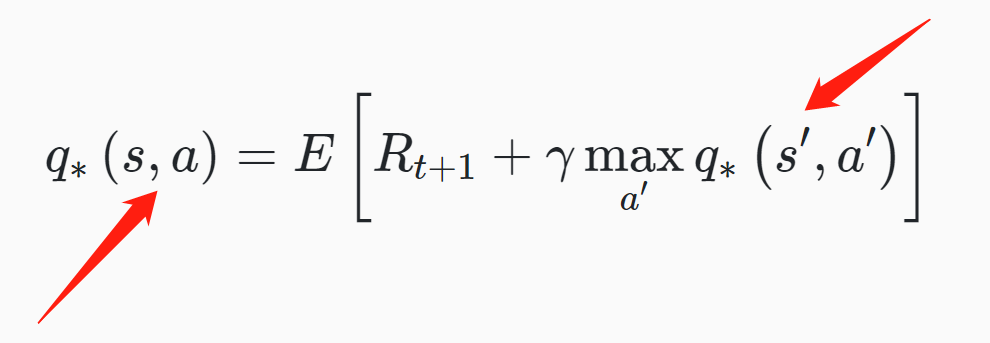
  <figcaption style="text-align:center; color:blue">
    Fig.6 Bellman Optimality Equation
  </figcaption>
</figure>

We read lots of blogs and articles about deep reinforcement learning and found out that the best way to implement this part is to use 2 neural networks: a policy net and a target net.  The policy net is to approximate the Q-value for the state-action pair from our original experience tuple and the target net is to approximate the target "optimal" Q-value from the same state-action pair. Then the difference between these 2 values is the loss of the policy network(Fig. 7). Since we are using the network to provide Q-value and use itself to evaluate, the target is moving all the time and it will cause the training extremely unstable(it's chasing its own tail all the time). Therefore, utilizing 2 different networks and only update the target net after several epochs can resolve this, hence the reason why we use 2 networks. 

<figure style="text-align:center; margin-left: auto; margin-right: auto;">
  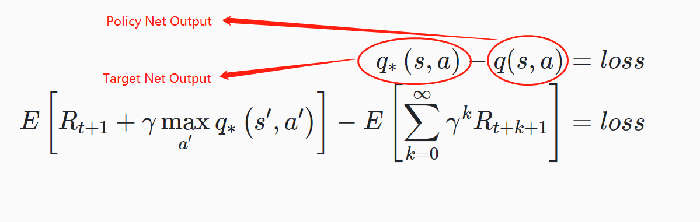
  <figcaption style="text-align:center; color:blue">
    Fig.7 Policy network loss function
  </figcaption>
</figure>

The idea of "Replay Memory" is also introduced in our implementation, before the actual training starts, a replay memory of fixed size is initialized to store the agent's experiences at each time step in a data set. Each entry of the replay memory is represented as a tuple that contains the state, the action taken by the agent, the reward given to the agent at time t+1, and the next state of the environment, like a snippet of a Markov Transition. While training, the replay memory data is randomly sampled as the input of the policy network. If we just sequentially feed the input into the network, the samples would be highly correlated and would, therefore, lead to inefficient learning. Taking random samples from replay memory breaks this correlation. 

To Finallize our training setup, we used a python library called Keras RL that utilize tensorflow as background to make the 2 DQN networks. The type of our networks is Sequential(Basically a Multilayer Perceptron network), because we don't need to use any convolution or pooling layer to process images. The configuration of these 2 nets are identical, both having 2 layers of 256 perceptrons.

Curriculum learning is also used while training. At first our goal is to train the agent so that the agent can play against a moving target, so we set up the environment to let the agent play against a still, non-monving target. However, as we carried out the training, the agent didn't perform good enough to step up the difficulty, so we sticked to training and evaluating the performance against a still target. 

## Evaluation
Evaluation Plans:  
1) Compare the average scores and standard deviation between different setups 
2) Arrange an arena in which agents fight each other and count the win rate

               

<figure style="text-align:center; margin-left: auto; margin-right: auto;">
  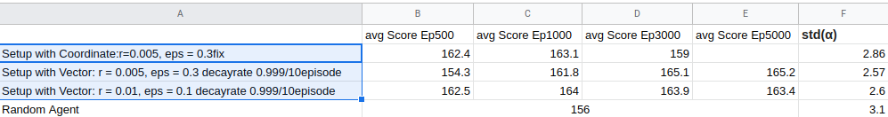
  <figcaption style="text-align:center; color:blue">
  	Fig.1 The average scores against static opponent with different setups in different stages
  </figcaption>
</figure>

Interpretation of Fig.1: As we can see here the original setup with use coordinates of two agents as training state starts with a higher score in the beginning, but failed to reach scores higher than 163 and overfits quickly. Therefore we abandon  this setup after seeing scores drops under 160 and having the trend to drop further. It has higher standard deviation than other two non-random agents, that was caused by the high epislon = 0.3 fix. It performs more like a random agent than the other two. 

Setup No.2 has a better performance than No.1 because of the decaying epislon and better implementaion, using vector instead of coordinates as training state which helps the agent progress faster and reduce the size of state from 10 to 7. Decaying epislon also reduce the standard deviation. 

Setup No.3 has a larger learning rate of 0.01 instead of 0.005 as the previous two agents. The starting epislon was lower too. So it can get the higher scores in less episodes.

<figure style="text-align:center; margin-left: auto; margin-right: auto;">
  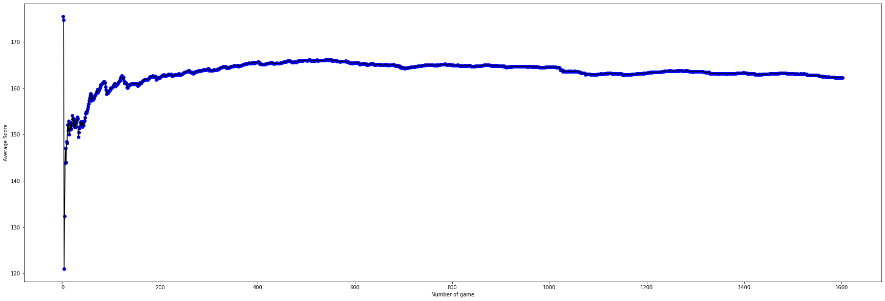
  <figcaption style="text-align:center; color:blue">
  	Fig.2 Coordinate Setup avg score plot
  </figcaption>
</figure>

<figure style="text-align:center; margin-left: auto; margin-right: auto;">
  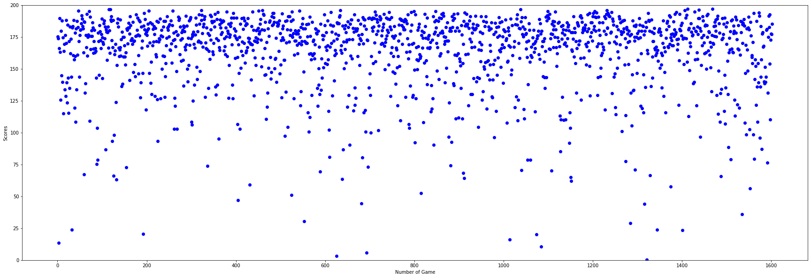
  <figcaption style="text-align:center; color:blue">
  	Fig.3 Coordinate Setup score dot plots
  </figcaption>
</figure>

<figure style="text-align:center; margin-left: auto; margin-right: auto;">
  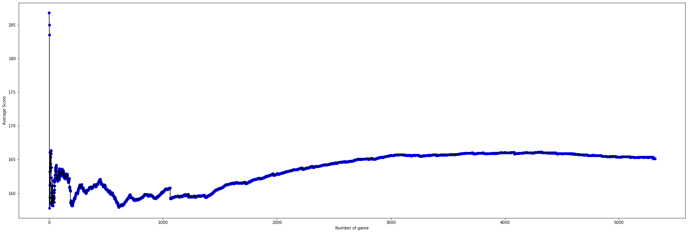
  <figcaption style="text-align:center; color:blue">
  	Fig.4 Vector Setup No.1 avg score plot
  </figcaption>
</figure>

<figure style="text-align:center; margin-left: auto; margin-right: auto;">
  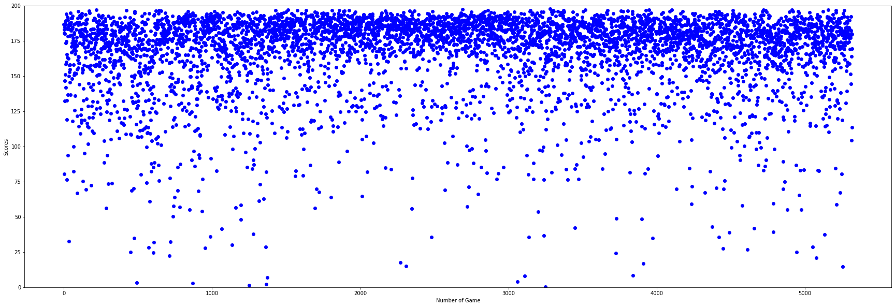
  <figcaption style="text-align:center; color:blue">
  	Fig.5 Vector Setup No.1 score dot plots
  </figcaption>
</figure>

<figure style="text-align:center; margin-left: auto; margin-right: auto;">
  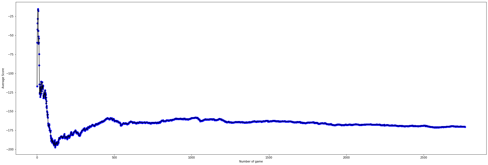
  <figcaption style="text-align:center; color:blue">
  	Fig.6 Vector Setup No.2 avg score plot
  </figcaption>
</figure>

<figure style="text-align:center; margin-left: auto; margin-right: auto;">
  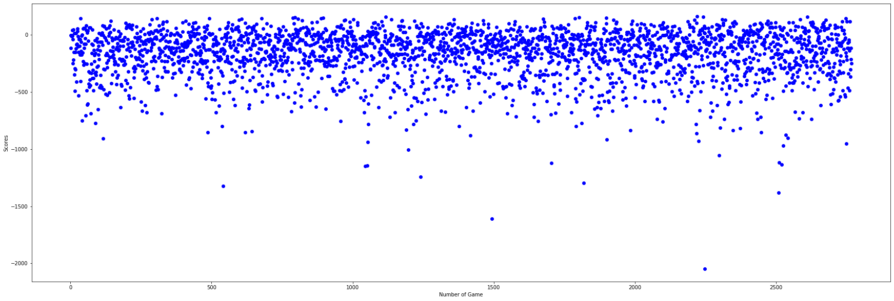
  <figcaption style="text-align:center; color:blue">
  	Fig.7 Vector Setup No.2 score dot plots
  </figcaption>
</figure>

2) Agents fight against each other
 

<figure style="text-align:center; margin-left: auto; margin-right: auto;">
  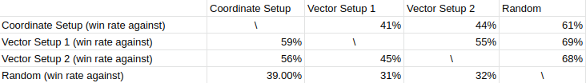
  <figcaption style="text-align:center; color:blue">
  	Fig.8 Agents against each other
  </figcaption>
</figure>

 
 
The Vector Setup 1 has an overall better performance

## References

Reinforcement Learning - Introducing Goal Oriented Intelligence with deeplizard: <a href="https://deeplizard.com/learn/video/nyjbcRQ-uQ8">https://deeplizard.com/learn/video/nyjbcRQ-uQ8</a>

Deep Q Learning is Simple with Keras - Machine Learning with Phil: <a href="https://www.youtube.com/watch?v=5fHngyN8Qhw">https://www.youtube.com/watch?v=5fHngyN8Qhw</a>

Deep Reinforcement Learning for Keras: <a href="https://github.com/keras-rl/keras-rl">https://github.com/keras-rl/keras-rl</a>

Tensorflow GPU acceleration: <a href="https://www.tensorflow.org/guide/gpu">https://www.tensorflow.org/guide/gpu</a>

Nvidia CUDA installation: <a href="https://docs.nvidia.com/cuda/cuda-installation-guide-linux/index.html">https://docs.nvidia.com/cuda/cuda-installation-guide-linux/index.html</a>

Malmo Class references: <a href="http://microsoft.github.io/malmo/0.30.0/Documentation/index.html">http://microsoft.github.io/malmo/0.30.0/Documentation/index.html</a>

Malmo XML Schema Documentation: <a href="http://microsoft.github.io/malmo/0.30.0/Schemas/Mission.html">http://microsoft.github.io/malmo/0.30.0/Schemas/Mission.html</a>

Minecraft command references: <a href="https://minecraft.gamepedia.com/Commands">https://minecraft.gamepedia.com/Commands</a>

How to throw fireballs in Minecraft: <a href="https://www.youtube.com/watch?v=qYDetuX3cM8">https://www.youtube.com/watch?v=qYDetuX3cM8</a>
