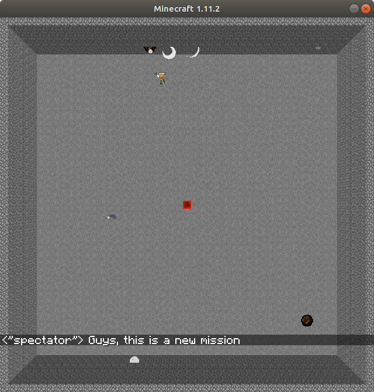
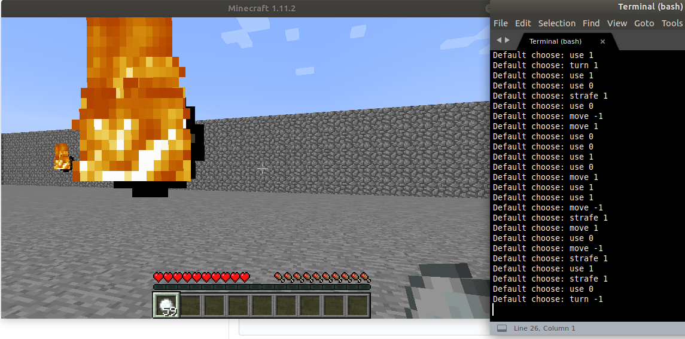

## Demo Video:

<!-- blank line -->
<figure class="video_container">
  <iframe width="1280" height="720" src="https://www.youtube.com/embed/UMcZHYxZHTo" frameborder="0" allowfullscreen="true"> </iframe>
</figure>
<!-- blank line -->
  
## What did we do?
Our project is around a Minecraft fireball battle game that we developed. We really dig deep into configuring this dodgeball battle inside Minecraft including setting projectile entity configuration, command blocks, and Minecraft in-game logic.

The arena is a 20 x 20 stone field with walls and each agent has an unlimited supply of fireballs. The rule of the game is very simple, there are two players inside the arena. Whoever defeats the opponent using Fireball will win the game.

We made two of the maps that would be our future arena to train our AI.
We wrote a basic agent that work as the parent class of other more complicated agents.
We made a random agent that pick eligible acts randomly.
We modified the game logistics to make throwing a fireball possible.

## A Monte-Carlo Approach
To make the training process easier, we restrict the possible actions for each agent, inside the game, the only valid actions are: moving the field of view to the left or the right, move forward or backward, and throw fireballs. To further zone in our task, we set the persecpt of our agent to have all general status of both itself and the opponent. 

The main algorithm that we use for training is Q-learning reinforcement learning. the strategy for our training is quite curriculum: 

In the beginning, we simply trained one random exploring agent to shoot fireballs to a non-moving target. And then, we inherited the Q table to the next generation where the target is making random movements The demo video shows the case that we apply the model that we trained from a random moving target to both sides of the battle. 

## What is next?
Get more features/datas fit in our agent, health of enemy, health of agent ect, so that our agent can perform both aggressively and conservatively.

Training against advance bot.

Training by actual human input.

Training fresh inside a complete new map with pillar obstacles.

## Evaluation Plan
As a baseline, we expect our agent at least to perform rationally as a player in the arena we made, for example, attacking when the opponent is close, jumping to clear the obstacles and moving around normally. After an extended training and having a better designed Q-table, we want our agent to create a somewhat challenging combat environment for the other player. This involves the agent to be tactical, aggressive or conservative depends on its situation, good at using items, and well worn for combat. 

